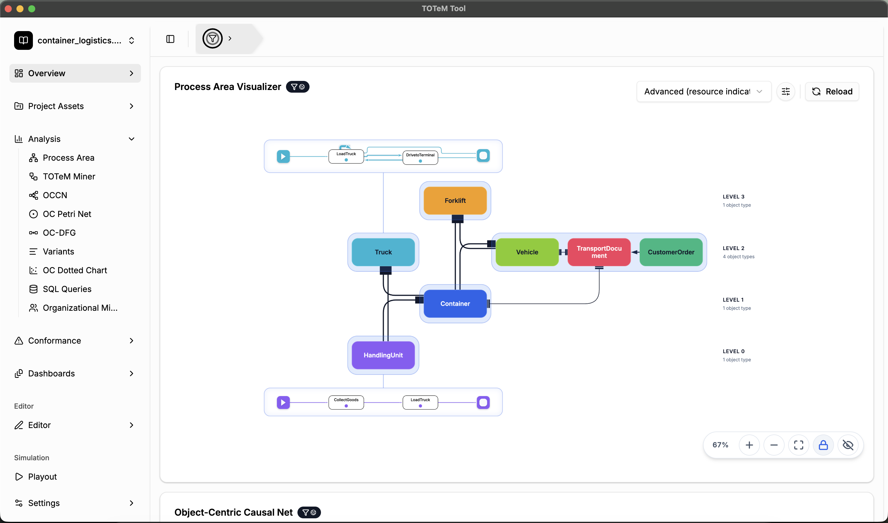

# TOTeM-Tool

The TOTeM Tool is an object-centric Process Analysis Tool that enables easy to use process import, discovery, conformance checking, and filtering capabilities.



## ✨ Features

Each linked page gives a short introduction to the feature with a screenshot.

* OCEL 2.0 File import (SQLite, XML, JSON)
* Analysis
   * [Process Area Discovery](docs/user-guide/process-area-discovery.md)
   * [TOTeM Discovery](docs/user-guide/totem-discovery.md)
   * [Object-Centric Causal Net (OCCN) Discovery](docs/user-guide/occn-discovery.md)
   * [Object-Centric Petri Net Discovery](docs/user-guide/oc-petri-net-discovery.md)
   * [Object-Centric Directly Follows Graph Discovery](docs/user-guide/oc-dfg-discovery.md)
   * [Object-Centric Variant Discovery](docs/user-guide/variant-discovery.md)
   * [Object-Centric Dotted Chart Analysis](docs/user-guide/dotted-chart.md)
   * Organizational Mining
      * [Object-Centric Handover of Work Analysis](docs/user-guide/handover-of-work.md)
      * [Object-Centric Resource Profiling](docs/user-guide/resource-profiling.md)
   * [SQL Queries](docs/user-guide/sql-queries.md)
* Conformance Checking
   * [TOTeM Conformance](docs/user-guide/totem-conformance.md)
   * [OCCN Conformance](docs/user-guide/occn-conformance.md)
* [Dashboard Creation for customized overviews](docs/user-guide/dashboards.md)
* [Project Asset Store](docs/user-guide/project-asset-store.md)
* [Editors](docs/user-guide/editors.md)
* [Playout](docs/user-guide/playout.md)

## 🚀 Quick Start

To run the application locally or contribute, please see our **[Developer Guide](DEVELOPMENT.md)**.

**One-time Setup:**
```bash
npm run setup-env
```

**Start App:**
```bash
npm run electron-dev
```

**Build Windows Executable:**
```bash
npm run build-all
```

## 📦 Distribution

The Windows executable is built using Electron and includes everything needed to run the application:
- Backend server and TOTeM library (built with PyInstaller)
- Frontend (served with Express.js)

## 📚 Documentation

- [DEVELOPMENT.md](DEVELOPMENT.md) - Development setup
- [GIT_GUIDE.md](docs/GIT_GUIDE.md) - Git management guidelines
- [MODEL_ASSETS.md](docs/MODEL_ASSETS.md) - Project model asset formats and upload behavior
- [MODEL_EDITORS.md](docs/MODEL_EDITORS.md) - Visual editors for TOTeM models, OC causal nets and OC Petri nets (incl. JSON formats)
- [OCCN_REPLAY_FITNESS.md](docs/OCCN_REPLAY_FITNESS.md) - OCCN replay strategies, API and UI behavior, result interpretation, examples, and limitations
- [PLAYOUT.md](docs/PLAYOUT.md) - Object-centric playout: enumerate and export all variants an OCPN/OCCN allows
- [RESOURCE_AWARE_VARIANTS.md](docs/RESOURCE_AWARE_VARIANTS.md) - Resource-aware variants, storing process executions in the log, OCCN conformance on stored executions, and the process-area filter action
