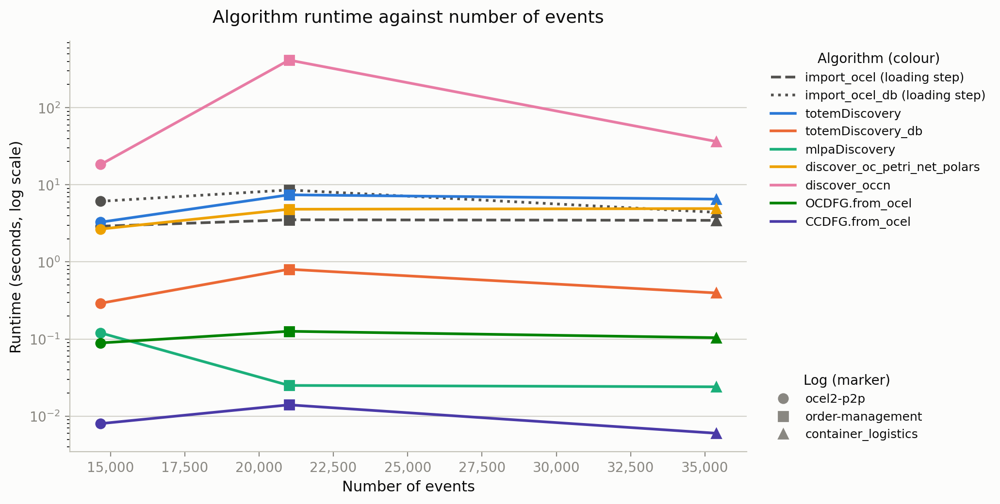

# totem-lib

Object-centric process mining in Python: OCEL 2.0 import, TOTeM
(Temporal Object Type Model) discovery and conformance checking, process
areas, object-centric directly-follows graphs (OC-DFG), object-centric Petri
nets (OCPN) and object-centric causal nets (OCCN).

`totem-lib` is the analysis core of the
[TOTeM Tool](https://github.com/LukasLiss/totem-tool); it has no web or UI
dependencies and can be used on its own.

## Installation

```bash
pip install totem-lib
```

Requires Python 3.10 or newer. All Python dependencies are installed
automatically. The [Graphviz](https://graphviz.org/download/) system binary
(`dot`) is only needed for rendering with `Totem.visualize()` and the other
`visualize` helpers; import, discovery and conformance checking work without
it.

The `example_data/` and `test_data/` directories referenced in the examples
below are not part of the wheel. Clone the
[repository](https://github.com/LukasLiss/totem-tool) to get them, or point
`import_ocel` at your own OCEL 2.0 file (`.sqlite`, `.json`, `.xml`, `.csv`
or `.duckdb`).

## Example usage

```python
from totem_lib import import_ocel, totemDiscovery, mlpaDiscovery

# Importing with automatic filetype detection
ocel = import_ocel("example_data/ContainerLogistics.sqlite")

# Mine the temporal graph first
totem = totemDiscovery(ocel, tau=0.9)

# Process Areas Mining
process_view = mlpaDiscovery(totem)
```

## TOTeM conformance checking

TOTeM conformance compares an independently loaded model with a current event
log. It does not discover or modify the model during the check.

```python
from totem_lib import conformance_of_totem, totem_from_dict
from totem_lib.ocel import import_ocel_db

model = totem_from_dict(model_json)
event_log = import_ocel_db("example_data/ContainerLogistics.sqlite")
try:
    result = conformance_of_totem(model, event_log)
    response_data = result.to_dict()
finally:
    event_log.close()
```

The implementation runs directly on `OcelDuckDB`. Discovery and conformance
share their aggregate histogram queries, while conformance uses the symmetric,
qualified object-to-object relation behavior of the original paper branch. No
Polars conversion or temporary model discovery is required.

`TotemConformanceResult` contains overall metrics, averages per object type,
metrics per directed type pair, and aggregate and detailed histograms. Its
`to_dict()` output is deterministic and JSON-compatible. Compound keys such as
type pairs are represented as records with named fields so object-type names do
not need delimiter escaping.

## OCCN replay-unit extraction

OCCN conformance checks concrete event sets called replay units. The default
strategy groups events by connected components of their shared objects. A
leading-object strategy is also available for targeted investigation:

```python
from totem_lib import (
    LEADING_OBJECT_REPLAY_STRATEGY,
    extract_occn_replay_units,
    import_ocel,
)

event_log = import_ocel("example_data/ocel2-p2p.json")
connected_units = extract_occn_replay_units(event_log)
order_units = extract_occn_replay_units(
    event_log,
    strategy=LEADING_OBJECT_REPLAY_STRATEGY,
    leading_object_type="orders",
)
```

The same API accepts an `ObjectCentricEventLog` or an `OcelDuckDB`. Both paths
produce immutable `OCCNReplayUnit` values with the same deterministic contract:

- events are ordered by `(timestamp_unix, event_id)`;
- units are ordered by their first event and receive IDs such as
  `connected_components:000001`;
- activity names, event IDs, timestamps, object IDs, and object types remain
  available for replay and diagnostics;
- events without objects remain visible as singleton units;
- objects without events do not create empty units;
- an empty log produces no replay units.

Connected-component units partition the visible events. Leading-object units
contain all events that directly reference one object of the selected type;
shared events can therefore occur in several leading-object units. Their IDs
use the leading object, for example `leading_object:order-42`.

Replay units contain only visible log events. Artificial `START_<type>` and
`END_<type>` activities are introduced internally by replay fitness and are
not added to the event log or extraction result.

Connected-component extraction can produce a very large unit when a few
objects connect most of a log. Neither strategy groups units into variants.
Timestamp ties are resolved by event ID because the supported storage backends
do not expose a shared source-row index. See
[`docs/OCCN_REPLAY_FITNESS.md`](https://github.com/LukasLiss/totem-tool/blob/main/docs/OCCN_REPLAY_FITNESS.md) for the complete
strategy, replay, result, and limitation contract.

## Development setup

To work on totem-lib itself (not needed for `pip install totem-lib`), clone the
repository and follow these steps inside `totem_lib/`.

### 1. Create a Virtual Environment

It is recommended to use a virtual environment to manage dependencies. Run the following command to create a virtual environment named `.venv`:

```bash
python -m venv .venv
# .venv\Scripts\activate # On Windows
source .venv/bin/activate # On Linux/MacOS
```

### 2. Install Dependencies

Once the virtual environment is activated, install the required packages:

```bash
pip install -r requirements.txt
```

### 3. Install the Package in Editable Mode

Finally, install the project itself in editable mode so changes to the code are immediately reflected:

```bash
pip install -e .
```

To run all tests, execute:

```bash
pytest ./tests/
```

## Evaluation logs

Runtime evaluation runs against real OCEL logs published on
[ocel-standard.org](https://www.ocel-standard.org/event-logs/overview/). Each log records
several size statistics, so runtime can be plotted against any of them.

| Log | Events | Objects | Activities | Object types | E2O relations | O2O relations |
|---|---|---|---|---|---|---|
| `ocel2-p2p` | 14,671 | 9,054 | 10 | 7 | 35,927 | 16,757 |
| `order-management` | 21,008 | 10,840 | 11 | 6 | 147,463 | 28,391 |
| `container_logistics` | 35,372 | 13,882 | 14 | 7 | 74,272 | 15,920 |

Which log is "bigger" depends on the metric: `order-management` has fewer events than
`container_logistics` but twice as many event-to-object relations.

All three ship with the repo and need no setup. Larger logs do not belong in git, so
`test_data/large/` is gitignored and populated on demand by a download script. Run from
the `totem_lib/` directory:

```bash
python evaluation/download_logs.py --list
python evaluation/download_logs.py --logs <name>
python evaluation/log_stats.py
```

`evaluation/datasets.py` is the manifest — names, source links, locations and recorded
statistics, with the full details in its module docstring. `log_stats.py` re-measures the
statistics and reports any that have drifted from what the manifest records.

The module docstring also records why the largest available OCEL log (Age of Empires 2,
2.4M events) cannot be used yet: it has 831 activity types, and `import_ocel`'s SQLite
path exceeds SQLite's compound-`SELECT` limit on logs that wide.

## Running the benchmarks

One command runs every main algorithm on every log and reports time and peak memory:

```bash
python evaluation/run_benchmarks.py
python evaluation/run_benchmarks.py --list
python evaluation/run_benchmarks.py --logs ocel2-p2p --repeats 1
python evaluation/run_benchmarks.py --algorithms totemDiscovery,OCDFG.from_ocel
```

Results print as each measurement finishes, so an interrupted run still shows everything
measured so far, and `--logs` / `--algorithms` fill in the rest later. A failing algorithm
is reported and the run continues.

Every run saves its results to `evaluation/results/`:

| File | For |
|---|---|
| `benchmark_results.md` | reading - two tables, one for the logs and one for the measurements |
| `benchmark_results.csv` | plots and other tools |
| `benchmark_results.json` | the same data plus a note of when the run happened |

Use `--out-dir` to save somewhere else and `--formats` to write only some of them, for
example `--formats md`. Each run overwrites the previous files. The generated JSON is
gitignored; the Markdown and CSV are not, so an example run can be committed.

It also saves one plot per size metric to `figures/`, named
`runtime_vs_<metric>.png`. Each figure uses two channels: the line **colour** says which
algorithm, the **marker shape** says which log a point came from. Runtime is on a log
scale because the algorithms differ by five orders of magnitude.

The two loading steps are drawn as grey baselines rather than coloured lines, because
they are what the other algorithms build on rather than discovery algorithms themselves.
`import_ocel` is dashed and reads the log into Polars; `import_ocel_db` is dotted and
reads the same file into DuckDB. Which one applies depends on the algorithm: five of
them need the Polars log, two need the DuckDB one.

Use `--no-figures` for a quick partial run: a filtered run would otherwise overwrite the
committed figures with incomplete data. To rebuild the figures from the saved results
without running anything:

```python
from evaluation.plots import plot_all, rows_from_csv
plot_all(rows_from_csv("evaluation/results/benchmark_results.csv"))
```

The algorithms differ enormously in cost — from `CCDFG.from_ocel` at ~0.01 s to
`discover_occn` at over 7 minutes on `order-management` — so try anything new on
`ocel2-p2p` with `--repeats 1` first. `evaluation/algorithms.py` lists what runs and how each one is
called; it is also where a new algorithm gets added.

## Example run

One full run is committed, so the output can be read without running anything. It was
produced on an otherwise idle machine with the default three repeats, leaving out the one
algorithm that cannot complete (see below):

```bash
python evaluation/run_benchmarks.py --repeats 3 \
  --algorithms import_ocel,import_ocel_db,totemDiscovery,totemDiscovery_db,mlpaDiscovery,discover_oc_petri_net_polars,discover_occn,OCDFG.from_ocel,CCDFG.from_ocel
```

That takes about 30 minutes, almost all of it `discover_occn` on `order-management`.

- [`evaluation/results/benchmark_results.md`](evaluation/results/benchmark_results.md) — the tables
- [`evaluation/results/benchmark_results.csv`](evaluation/results/benchmark_results.csv) — the same rows, for tools
- [`figures/`](figures/) — one plot per size metric



### What it shows

The choice of x-axis changes the story, which is why the tool records six size metrics
instead of only the event count.

`discover_occn` is by far the slowest algorithm, and it is slowest on
`order-management` — the log in the **middle** by event count, not the largest. Plotted
against events its line spikes and then falls, which reads as nonsense. Plotted against
event-to-object relations it rises steadily, because that is what it actually scales
with: `order-management` has 147k such relations against 74k for the larger
`container_logistics`.

Compare the two figures side by side:

- [runtime against events](figures/runtime_vs_num_events.png) — the misleading view
- [runtime against event-to-object relations](figures/runtime_vs_num_e2o_relations.png) — the explanatory one

### DuckDB is fast, but the loading is not free

`totemDiscovery_db` looks dramatically faster than the Polars `totemDiscovery` — 9x to
17x on the algorithm alone. That is real, but on its own it is misleading, because the
two need different loaders and loading into DuckDB costs more.

| Log | Loading | Algorithm alone | Whole job |
|---|---|---|---|
| `ocel2-p2p` | 2.90 s / 6.12 s | 3.28 s / 0.29 s = 11.3x | 6.18 s / 6.41 s = **0.96x** |
| `order-management` | 3.52 s / 8.58 s | 7.42 s / 0.80 s = 9.2x | 10.94 s / 9.38 s = **1.17x** |
| `container_logistics` | 3.46 s / 4.40 s | 6.53 s / 0.40 s = 16.5x | 9.99 s / 4.79 s = **2.08x** |

(Polars / DuckDB.)

Read end to end, the advantage shrinks a lot, and on the smallest log it disappears — the
whole job is slightly *slower* through DuckDB. The win grows with the log, so DuckDB
still looks like the better bet as logs get bigger. But one load feeding many algorithms
is where it pays off, not one load feeding one algorithm.

### How to read the numbers

- **Timings are from one machine** (a Windows dev laptop) and are only meaningful
  relative to each other. Re-run the command to get numbers for your own hardware.
- **Peak RAM understates Polars and DuckDB.** It comes from `tracemalloc`, which counts
  Python allocations only, and both libraries do most of their work in native memory.
- **Two metrics are weak axes.** Object types (6–7) and activities (10–14) barely vary
  across three logs, so those two figures show little. A larger log would fix this; the
  2.4M-event Age of Empires log is not usable yet, for the reason recorded in
  `evaluation/datasets.py`.
- **`find_variants` is missing.** It exhausts memory on `order-management` and ends in a
  `MemoryError`, so it is left out of the committed run rather than taking the machine
  down with it. `order-management` has 147k event-to-object relations, twice
  `container_logistics`, and variant extraction scales with that rather than with events.
  Run it on its own if you want to measure it.
- **The two importers disagree slightly.** The `_db` algorithms build their DuckDB copy
  from the same OCEL file the Polars side reads, so both measure the same log. They are
  not byte-identical though: the Polars importer filters out objects the DuckDB one
  keeps, so `ocel2-p2p` has 9,543 objects on the DuckDB side against 9,054 on the Polars
  side. Event counts and labels match everywhere.
- **Both loaders are timed, so compare like with like.** A Polars algorithm costs
  `import_ocel` plus its own time; a DuckDB one costs `import_ocel_db` plus its own. The
  algorithm rows on their own leave the loading out.
- **Re-running with `--logs` or `--algorithms` overwrites these files** with partial
  data. Regenerate the committed example only from the full command.

## Acknowledgements

The TOTeM module is based on the original implementation by [Lukas Liss](https://github.com/LukasLiss/multi-level-resource-detection/).

The TOTeM visualization function is adapted from [this repository](https://github.com/loeseke/object-centric-streaming-discovery/).

The OCCN class and its conformance checking functions are adapted from [this repository](https://github.com/olekuhlmann/OCCN-OCPN-Transformer).

The OCCN miner and visualizer are ported from the [OCCN-Miner](https://github.com/LukasLiss/OCCN-Miner), originally implemented by [Caspar Mensing](https://github.com/CasparMensing/OCFHM).

Object-Centric Causal Nets are introduced in [Liss et al. (2025), _Object-Centric Causal Nets_, CAiSE 2025](https://doi.org/10.1007/978-3-031-94571-7_6). See [`examples/OCCN.md`](https://github.com/LukasLiss/totem-tool/blob/main/totem_lib/examples/OCCN.md) for a get-started guide.

The `process_areas` module implements chapter 4.1 of Moritz Schlegelmilch's bachelor thesis _Discovering Advanced Resource-Based Process Areas_ (PADS, RWTH Aachen, 2026), and is ported from its [reference implementation](https://github.com/moritzkschlegelmilch/Thesis). It extends the multi-level process area detection of [Liss & van der Aalst (2026), _Process Area Extraction by Multilevel Resource Detection for Object-Centric Process Mining_, BPM 2026](https://doi.org/10.1007/978-3-032-02867-9_13), which `mlpaDiscovery` implements. See [`examples/PROCESS_AREAS.md`](https://github.com/LukasLiss/totem-tool/blob/main/totem_lib/examples/PROCESS_AREAS.md) for a get-started guide.
